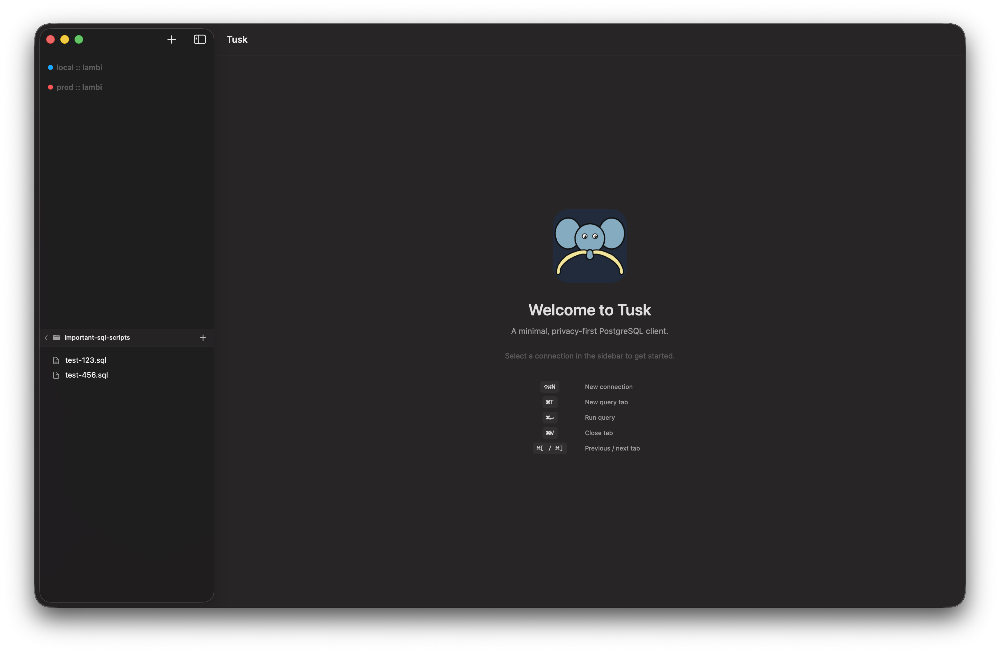
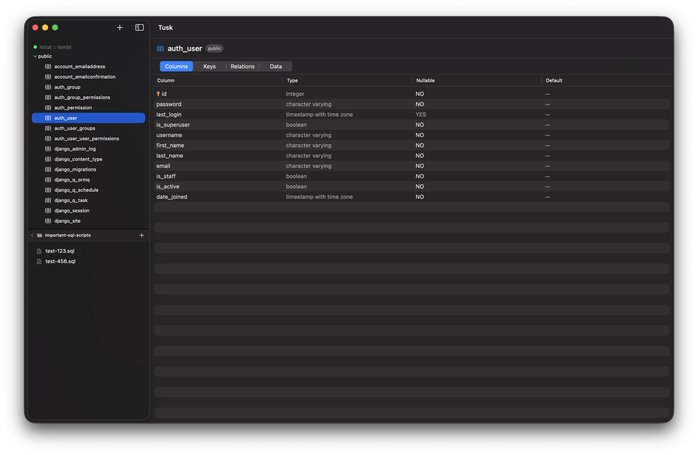
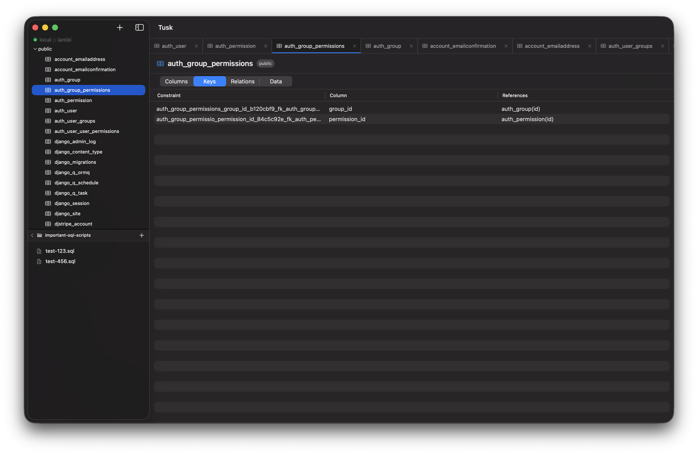
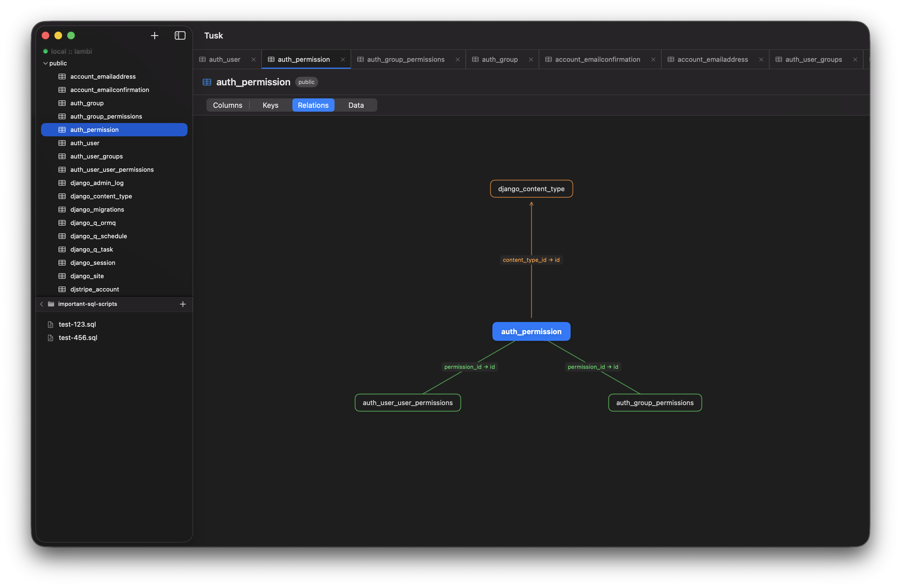
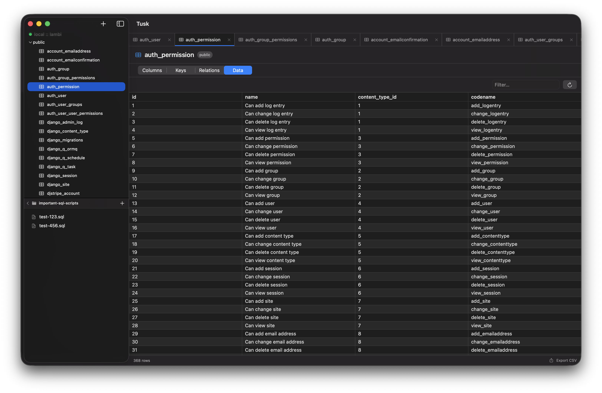
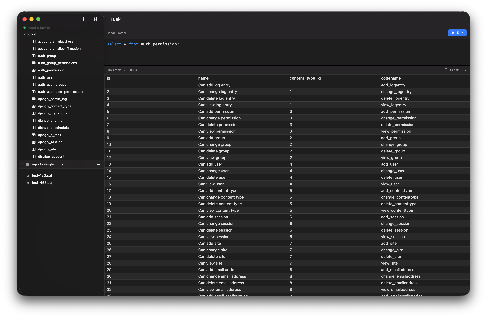

<p align="center">
  
</p>

# Tusk

* Minimal, native macOS PostgreSQL client
* Built in SwiftUI for macOS 14+

### Features

* Connection credentials stored in the system Keychain
* SSH tunnel support
* Schema browser — tables, columns, indexes, foreign keys
* Data browser — with filtering
* SQL query editor with syntax highlighting

### Non-Features

* No Electron
* No Telemetry
* No Subscription

---

**[Download Tusk-1.1.2.dmg](https://github.com/Shape-Machine/tusk-macos/releases/download/v1.1.2/Tusk-1.1.2.dmg)** — macOS 14+ · [All releases](https://github.com/Shape-Machine/tusk-macos/releases)

> Not notarized. On first launch right-click → **Open**, or run `xattr -d com.apple.quarantine /Applications/Tusk.app`.

---

## Screenshots

<table>
  <tr>
    <td></td>
    <td></td>
  </tr>
  <tr>
    <td></td>
    <td></td>
  </tr>
  <tr>
    <td></td>
    <td></td>
  </tr>
</table>

---

## Development

### Requirements

* macOS 14+
* Xcode 16+
* [xcodegen](https://github.com/yonaskolb/XcodeGen) — `brew install xcodegen`

### Setup

```sh
git clone https://github.com/Shape-Machine/tusk-macos.git
cd tusk-macos
xcodegen generate
open Tusk.xcodeproj
```

```sh
make clean build run
```
