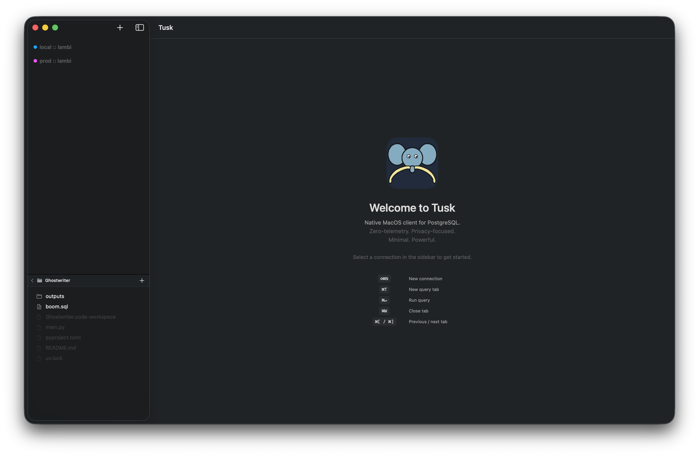
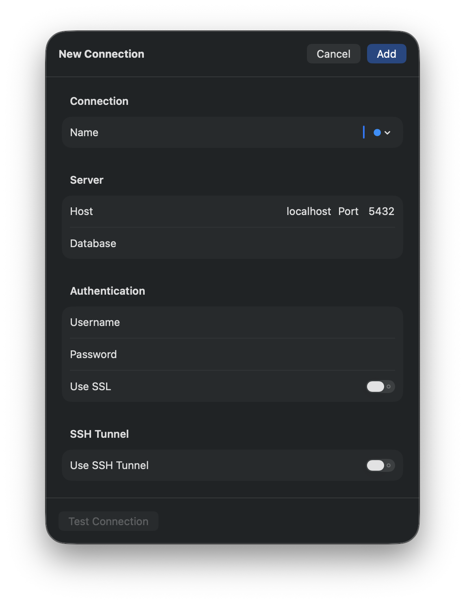
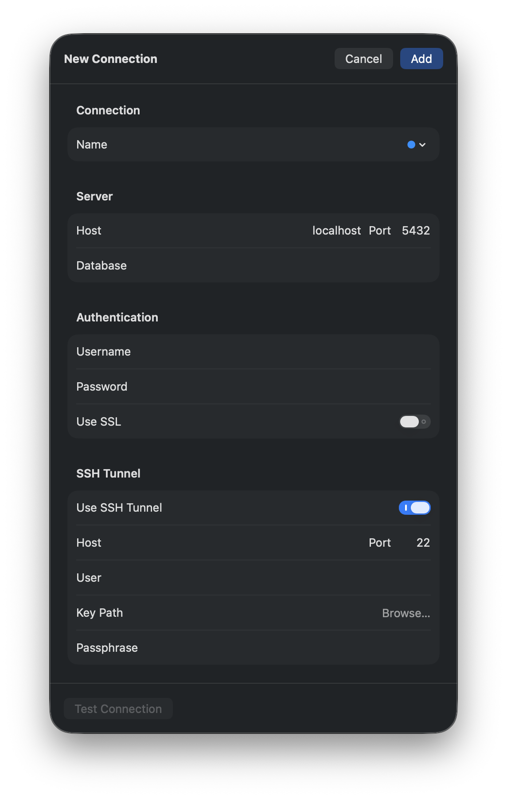
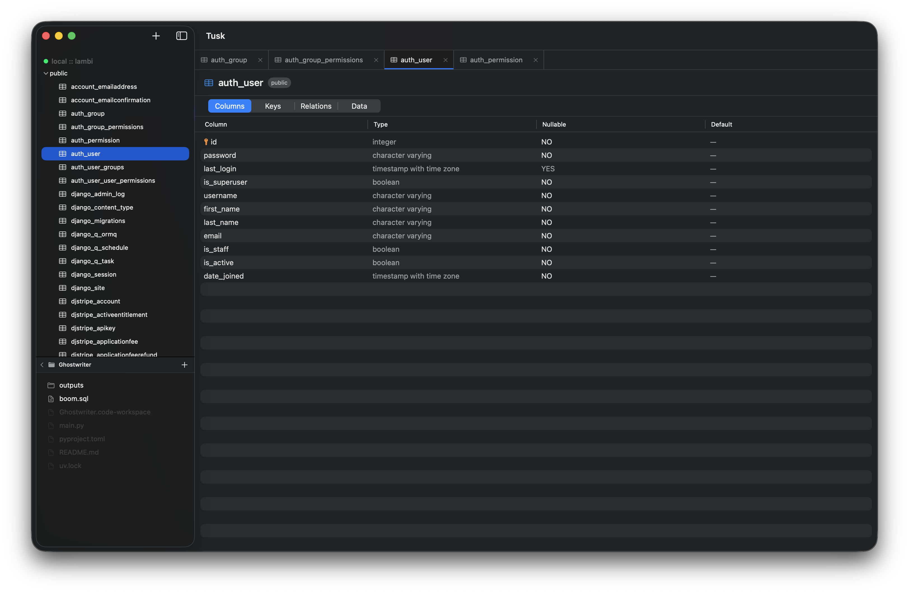
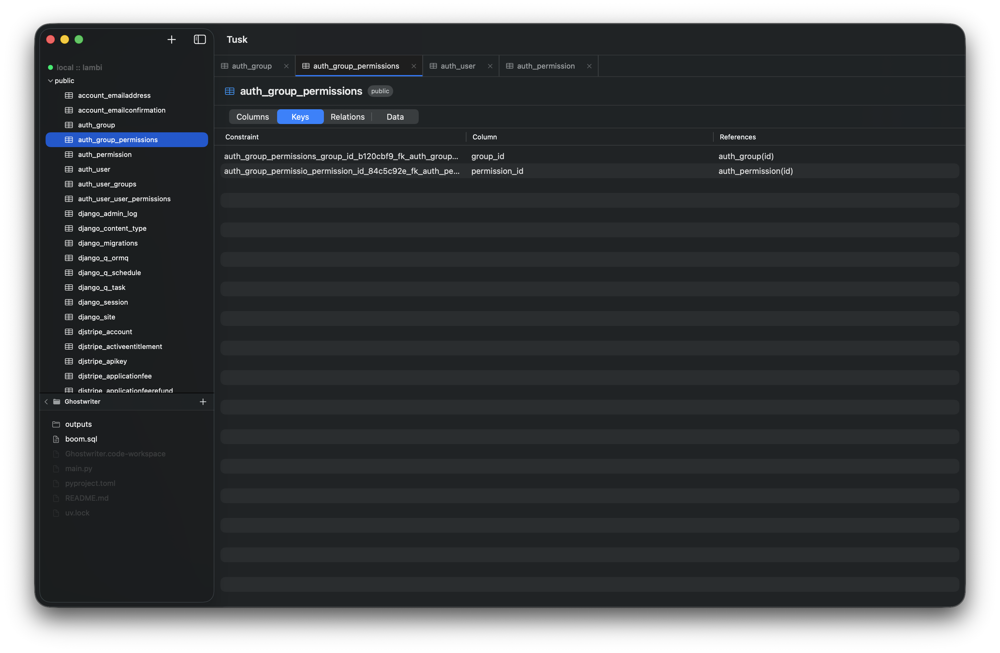
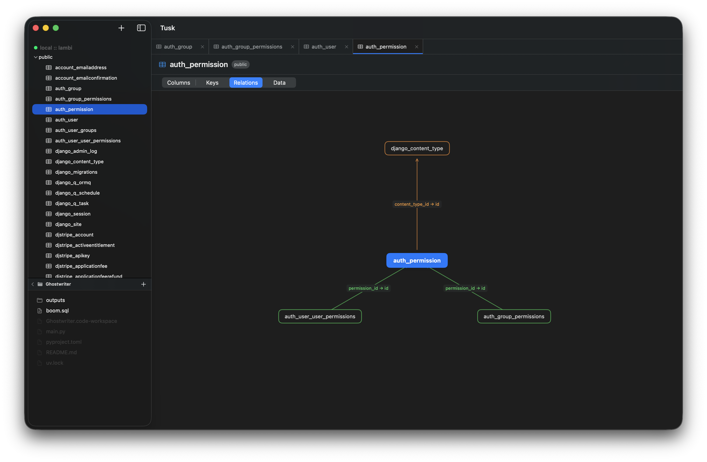
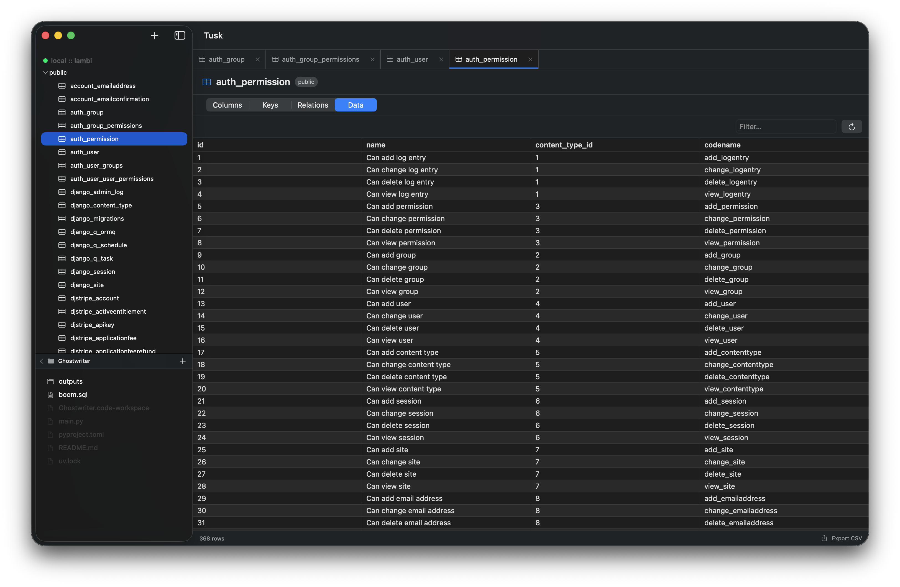
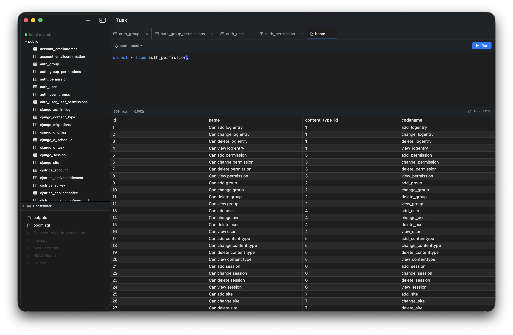
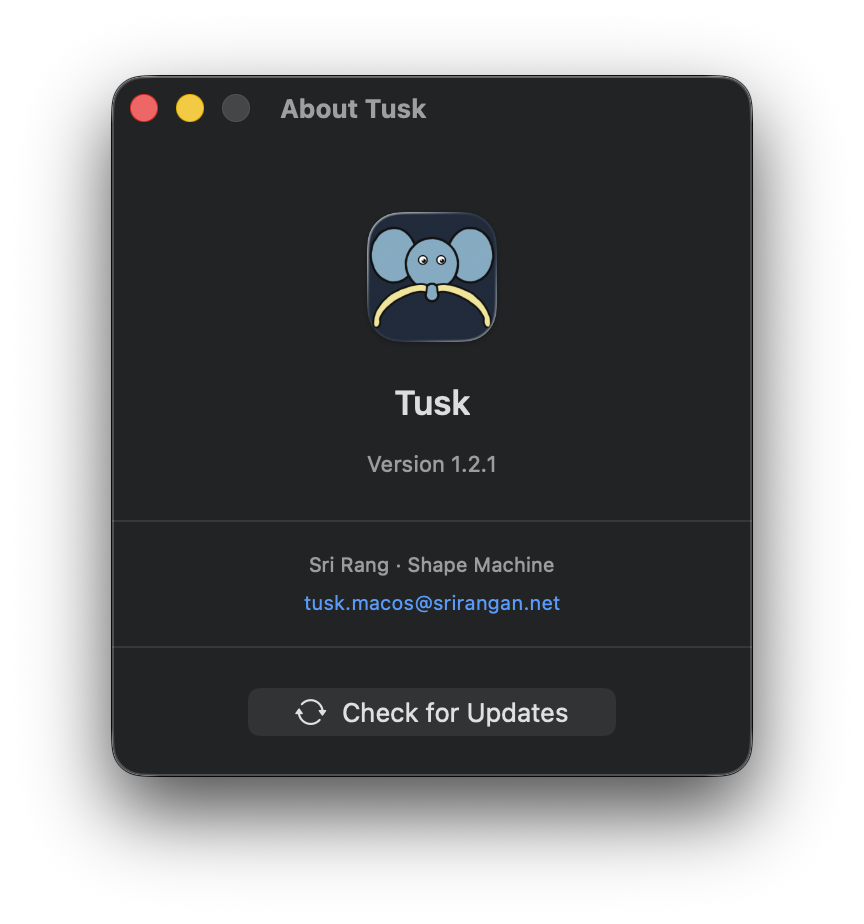

<p align="center">
  
</p>

# Tusk

* Minimal, native macOS PostgreSQL client
* Built in SwiftUI for macOS 14+

### Connections
PostgreSQL connections with name, host, port, credentials, SSL toggle. Passwords and SSH passphrases stored in Keychain. SSH tunnel support with automatic port forwarding and key-based auth. Color tagging per connection. Connect/disconnect in one click.

### Schema Browser
Full schema tree in sidebar — schemas → tables. Auto-expands `public`. Click a table to open it.

### Table Detail
Four views per table: columns (with types, nullability, defaults, PK indicators), foreign keys, incoming/outgoing relations visualized as a radial graph, and live data.

### Data Browser
Paginated grid (1000 rows/page). Column sorting. Real-time text filter. CSV export.

### Query Editor
SQL editor with live syntax highlighting. `Cmd+Enter` to run. Per-tab connection picker. Results in a grid with row count, execution time, and capped indicator. Double-click any cell for full value. File-backed queries autosave every 500ms.

### File Explorer
Local filesystem browser in the sidebar. Create, rename, delete SQL files and folders. Open `.sql` files directly into query editor. Last directory persisted.

### Tabs
Unlimited tabs — tables and query editors. Color-coded dots per connection. `Cmd+T` new tab, `Cmd+W` close, `Cmd+[/]` navigate.

### Appearance
Font size (11–17pt) and font family (Sans, Serif, Mono, Rounded) — configurable separately for sidebar and content. Live-applied, persisted.

---

No Electron. No telemetry. No subscription.

---

**[Download Tusk-1.3.0.dmg](https://github.com/Shape-Machine/tusk-macos/releases/download/v1.3.0/Tusk-1.3.0.dmg)** — macOS 14+ · [All releases](https://github.com/Shape-Machine/tusk-macos/releases)

> Not notarized. On first launch right-click → **Open**, or run `xattr -d com.apple.quarantine /Applications/Tusk.app`.

---

## Screenshots



















---

## Development

### Requirements

* macOS 14+
* Xcode 16+
* [xcodegen](https://github.com/yonaskolb/XcodeGen) — `brew install xcodegen`

### Setup

```sh
git clone https://github.com/Shape-Machine/tusk-macos.git
cd tusk-macos
xcodegen generate
open Tusk.xcodeproj
```

```sh
make clean build run
```
