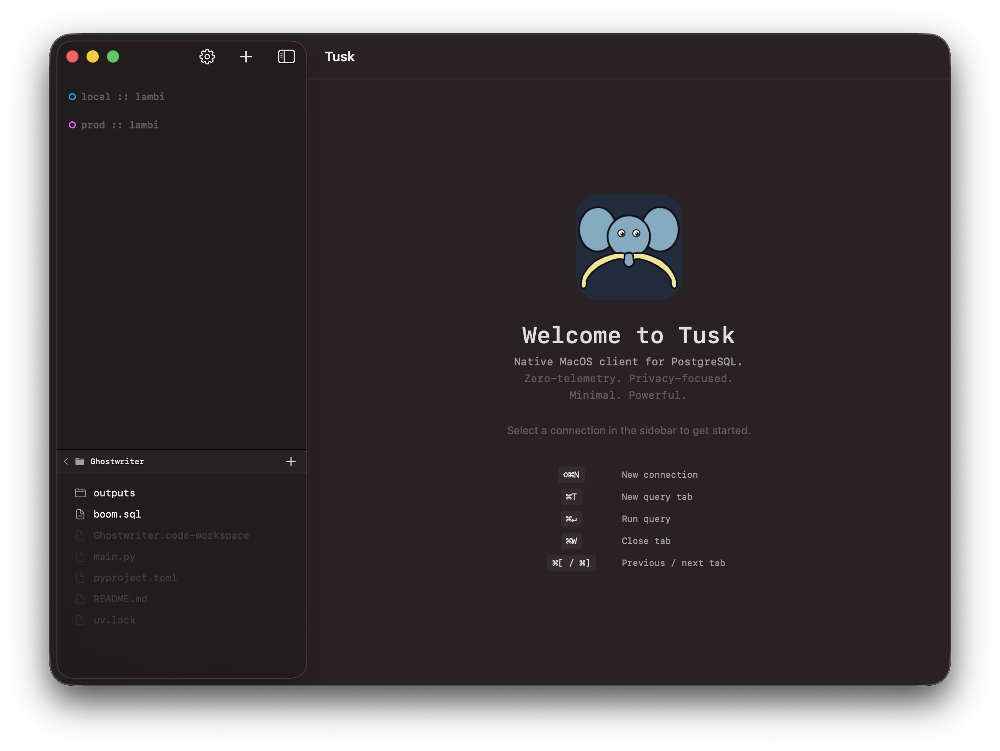
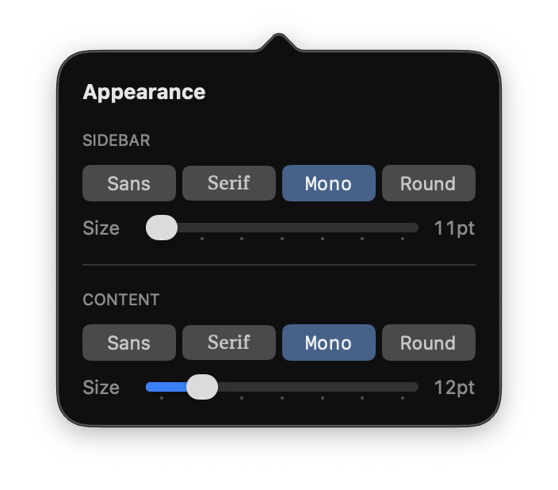
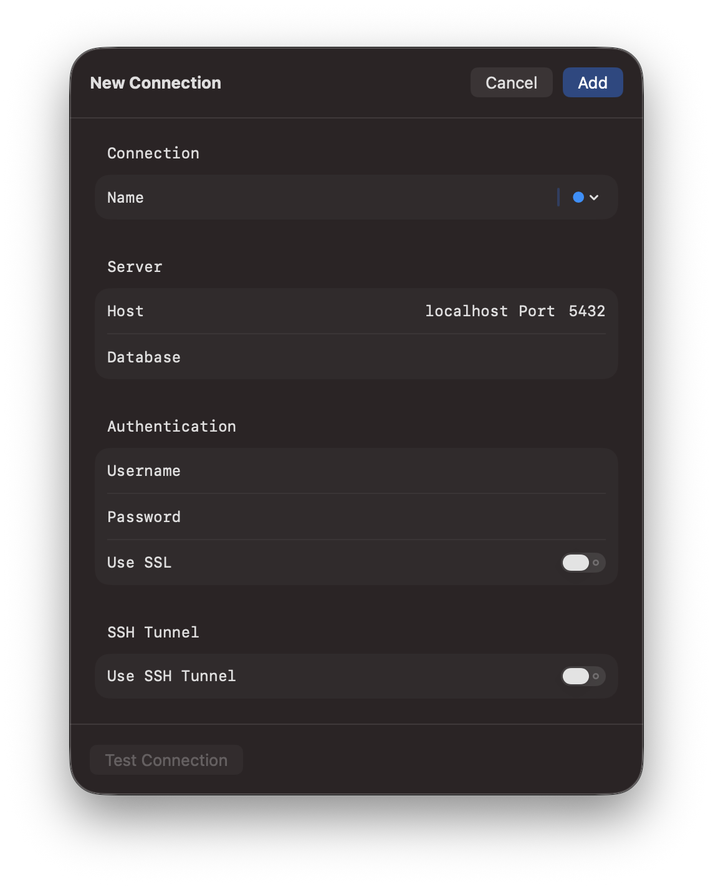
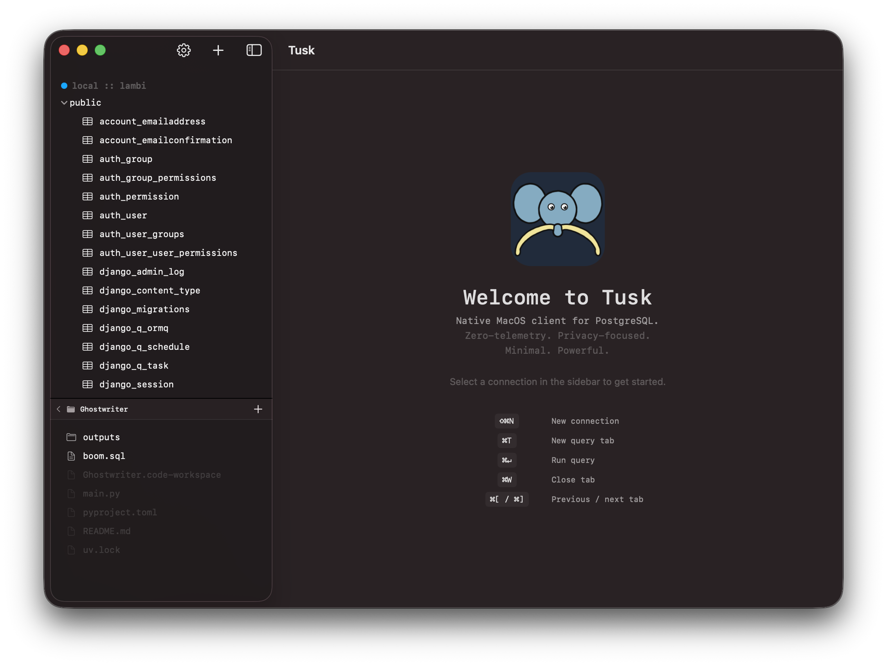
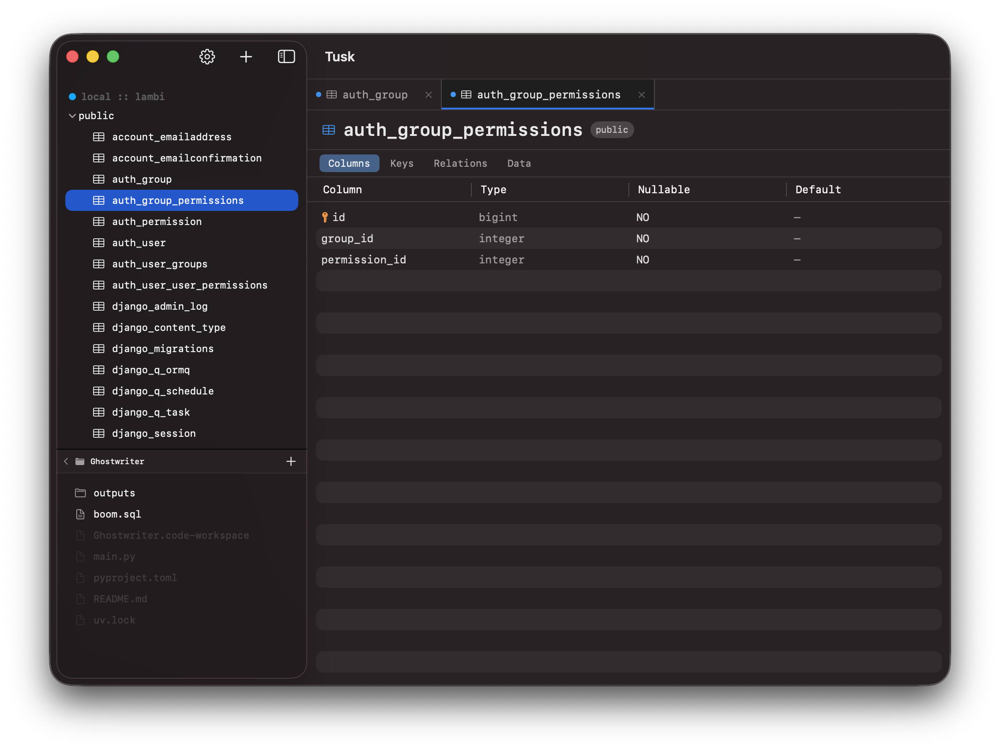
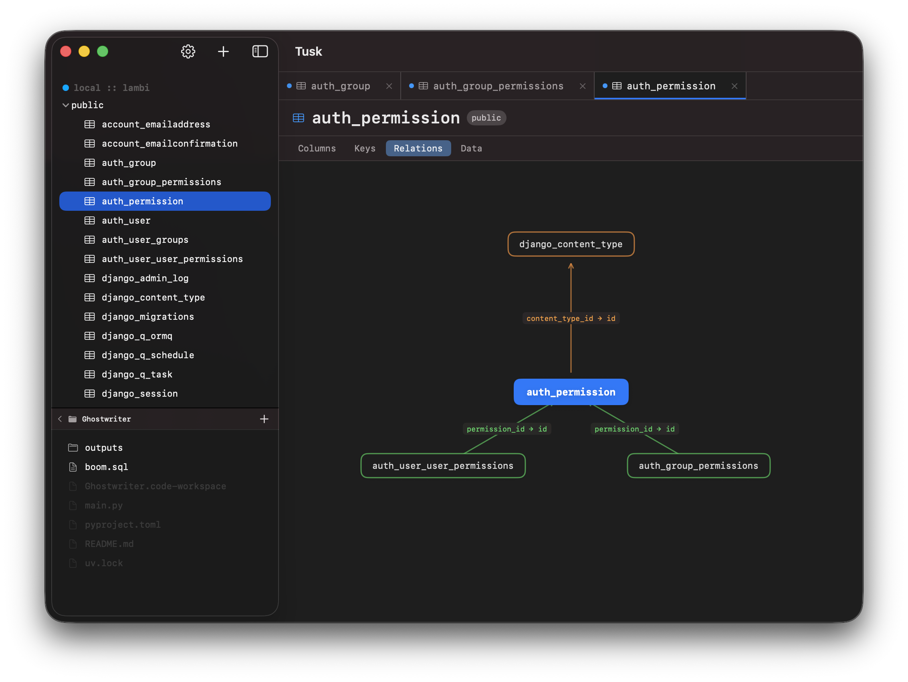
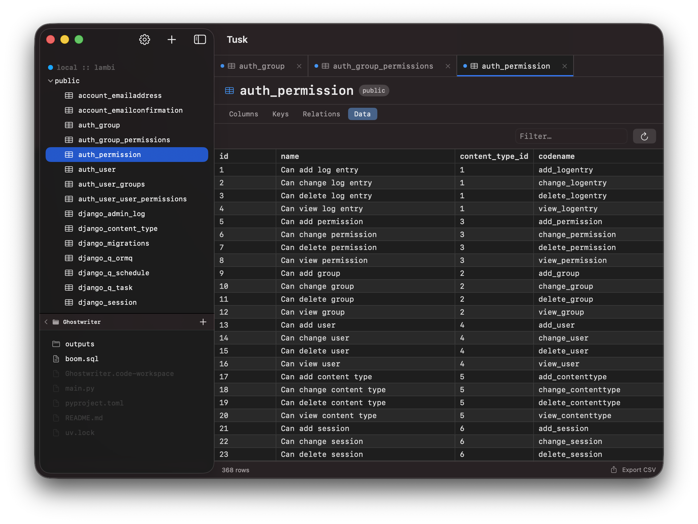
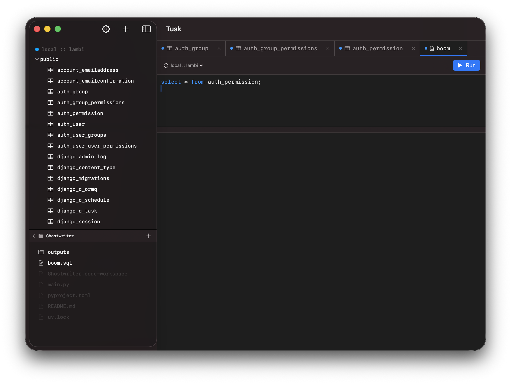
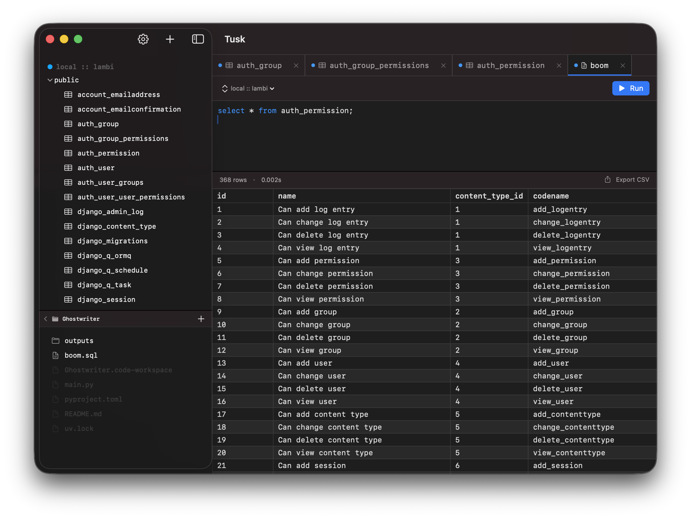

<p align="center">
  
</p>

# Tusk

* Minimal, native macOS PostgreSQL client
* Built in SwiftUI for macOS 14+

---

<h3 align=center><a href="https://github.com/Shape-Machine/tusk-macos/releases/download/v1.3.0/Tusk-1.3.0.dmg">Download Tusk-1.3.0.dmg</a><small> — macOS 14+</small></h3>
<p align=center>
<em>
Not notarized.<br/>
On first launch right-click → <strong>Open</strong>, or<br/>
run <code>xattr -d com.apple.quarantine /Applications/Tusk.app</code>
</em>
</p>

---

## Features

See [docs/features.md](docs/features.md) for a full breakdown.

---

## Non Features

No Electron. No telemetry. No subscription.

---

## Screenshots




















---

## Development

### Requirements

* macOS 14+
* Xcode 16+
* [xcodegen](https://github.com/yonaskolb/XcodeGen) — `brew install xcodegen`

### Setup

```sh
git clone https://github.com/Shape-Machine/tusk-macos.git
cd tusk-macos
xcodegen generate
open Tusk.xcodeproj
```

```sh
make clean build run
```
